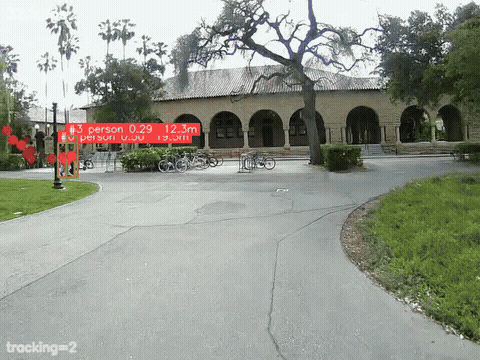
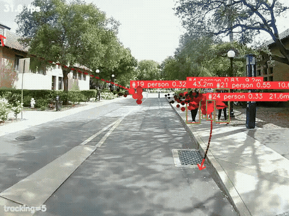
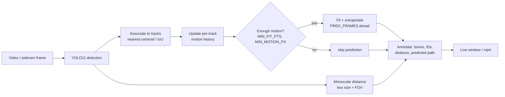

# YOLO Object Detection + Trajectory Prediction

Real-time **object detection, multi-object tracking, monocular distance, and per-object
motion/trajectory prediction** on top of [Ultralytics YOLO11](https://github.com/ultralytics/ultralytics).
Each tracked object gets a **predicted future path** (dashed curve + arrowhead) extrapolated from
its recent motion, plus a rough monocular distance estimate.

It was originally prototyped for a **batting-cage** use case (track the ball + batter and draw the
predicted flight path), but it runs on any video file or webcam — the demo below is campus driving
footage from a golf-cart front camera.



*(Red boxes = detections, with monocular distance. Red dashed lines + arrows = predicted object
trajectories. Full clip: [`assets/demo.mp4`](assets/demo.mp4).)*



*(A second segment — pedestrians crossing — full clip: [`assets/demo2.mp4`](assets/demo2.mp4).)*

## Scope

This is a standalone **perception prototype** built toward a self-driving golf cart's
**object-avoidance** goal. The cart currently runs an end-to-end **segmentation** model for driving;
this detection + trajectory-prediction module is **not yet integrated** into that stack — it's a
forward-looking building block for predicting where nearby objects (pedestrians, vehicles) are headed.

## Features

- **Detection** — Ultralytics YOLO11 (`yolo11n` by default; auto-downloaded on first run).
- **Tracking** — lightweight centroid/IoU multi-object tracker with track IDs and motion history.
- **Trajectory prediction** — fits each track's recent motion and extrapolates `PRED_FRAMES` ahead,
  drawn as a fading dashed curve with an arrowhead at the predicted endpoint. Confidence-gated
  (`MIN_FIT_PTS`, `MIN_MOTION_PX`) so noisy/early tracks don't produce wild predictions.
- **Monocular distance** — coarse per-object distance from bounding-box geometry + camera FOV.
- **Headless rendering** — write an annotated `.mp4` with `--headless --out`, or watch live.

## Install

```bash
pip install -r requirements.txt
```

Requires Python 3.10+. The YOLO weights (`yolo11n.pt`) download automatically on first run.

## Usage

```bash
# Live webcam
python batting_cage_detect.py --cam 0

# A video file, live window
python batting_cage_detect.py --video path/to/clip.mp4

# Headless: render an annotated mp4 (what produced the demo above)
python batting_cage_detect.py --video clip.mp4 --headless --out result.mp4
```

Key flags:

| Flag | Default | Description |
|------|---------|-------------|
| `--cam N` / `--video PATH` | webcam 0 | input source (mutually exclusive) |
| `--out PATH` | – | write annotated video |
| `--headless` | off | no GUI window (for rendering) |
| `--model PATH` | `yolo11n.pt` | YOLO weights |
| `--conf` / `--iou` | 0.20 / 0.45 | detection thresholds |
| `--fov` | 70.0 | camera horizontal FOV (deg), used for distance |

### `combined_view.py`

A "YOLO + BEV" variant that shows the camera view alongside a bird's-eye-view with tracked objects
and their predicted paths:

```bash
python combined_view.py --video clip.mp4 --out combined.mp4 --headless
```

## How it works



1. **Detect** objects per frame with YOLO11.
2. **Associate** detections to existing tracks (nearest-centroid / IoU), updating each track's
   position history.
3. **Predict** — once a track has enough motion history (`MIN_FIT_PTS` points, `MIN_MOTION_PX`
   displacement), extrapolate its trajectory `PRED_FRAMES` frames forward and draw it.
4. **Estimate distance** from box size + FOV and annotate each object.

Files: `batting_cage_detect.py` (main app), `depth_bev.py` (detection wrapper + geometry helpers),
`combined_view.py` (camera + BEV variant).

## Credits & license

**Detection backbone:** [Ultralytics YOLO11](https://github.com/ultralytics/ultralytics) provides the
object detector. It is licensed under **AGPL-3.0**, so any redistribution or deployment of this project
must comply with AGPL-3.0.

**Original work in this repo** — everything built on top of the YOLO detections is mine:

- **Multi-object tracker** — centroid / IoU association with stable track IDs and per-track motion history
- **Trajectory prediction** — fitting each track's recent motion and extrapolating its future path forward
- **Confidence gating** — `MIN_FIT_PTS` / `MIN_MOTION_PX` thresholds so noisy or just-spawned tracks don't emit wild predictions
- **Monocular distance** — per-object range from bounding-box geometry + camera FOV
- **BEV view** — the bird's-eye-view rendering of tracked objects and their predicted paths (`combined_view.py`)
